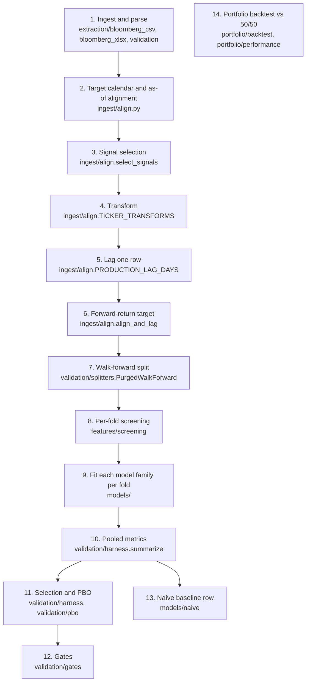

# Methodology

What the engine does to a Bloomberg export before a model is scored, and how
each model is fitted, scored, selected and gated. Every value below is the
code's own constant, named with its module; the [parameters table](#parameters)
lists them all, and `tests/unit/test_methodology_doc.py` fails if any of them
changes without this document being updated.

Module paths are relative to `src/forecasting_engine/` unless they start with
`app/`.

## Pipeline

Step 14 consumes an optimiser's weight schedule rather than the steps above: it
judges an allocation, not a forecast.

## 1. Ingestion and parsing

Targets and signals are uploaded separately on the Data page, so which series is
a target is decided at ingestion, never inferred later.

- **Reading.** A CSV export is a metadata block then a table headed `Date,...`,
  found by scanning rather than at a fixed row (`extraction/bloomberg_csv.py`).
  An `.xlsx` export is a `Data` sheet and a `Metadata` sheet
  (`extraction/bloomberg_xlsx.py`). Every data column is renamed
  `{security}_{field}`, e.g. `VIX_Index_PX_LAST`. Files over `MAX_UPLOAD_BYTES`
  are refused (`ingest/upload.py`).
- **Per-file schema.** Each file is checked on its own before merging
  (`extraction/validation.schema_errors`). A column whose name contains a
  `PRICE_FIELD_MARKERS` entry must be positive; any other must lie within
  `SANE_RANGE`. A failing file is excluded, and the good files still merge.
- **Merge.** Files are outer-joined on `Date`. Two files sharing a security are
  relabelled by file name. A column with no value on any date is dropped
  (`bloomberg_csv.drop_empty_columns`), and the drop is listed in the data quality
  report.
- **Target roles.** A target file's security pre-fills its role from
  `TARGET_TICKERS`, and its field defaults to `PREFERRED_FIELD` (total return).
  The person uploading confirms or changes both.
- **Report, not correction.** The data quality report counts duplicate and
  weekend dates, missing values per column, and day-over-day changes whose robust
  (median-absolute-deviation) z-score exceeds `MAD_THRESHOLD`. Nothing in it is
  auto-corrected.
- **Commit.** "Use Updated Data" commits the merged frame, the target columns and
  each column's security and field (`bloomberg_csv.column_sources`). Nothing is
  forward-filled.

## 2. Target calendar and as-of alignment

`ingest/align.align_and_lag` builds one panel per target:

1. The calendar is the dates the target has a price. Every other row is dropped.
   The target is never filled.
2. Each signal takes its last observed value on or before each calendar date.
   A value more than `MAX_STALENESS` calendar rows old is treated as missing. The
   Fama-French factors are matched by exact date only, never carried forward.
3. The Models page reports, per signal, how many values were carried forward and
   how many rows have no value once transformed and lagged.

## 3. Signal selection

`ingest/align.select_signals`:

- Every field of a target's security is left out, not only the target column,
  for both targets. The target securities come from the committed target
  assignment, never from a hard-coded list.
- Each security contributes one column: its `TOT_RETURN_INDEX` field if there is
  one, otherwise `PX_LAST` (`_PRICE_FIELD`), otherwise its first other field. Bid
  and ask quotes (`_QUOTE_FIELDS`) are never used.

## 4. Transform map

`ingest/align.TICKER_TRANSFORMS` classifies each ticker by the kind of series it
is:

| Category | Tickers | Transform |
|---|---|---|
| Risk gauges | VIX, JPMVXYGL, LUACOAS, LF98OAS | level (used as is) |
| Rates and curve | USGGBE10, USGG10YR, USYC2Y10 | difference |
| Prices and total-return indices | LF98TRUU, LEGATRUU, LBUSTRUU, SPX, DXY | log return |

Any field starting `TOT_RETURN_INDEX` is a log return whatever its ticker. A
signal with no known ticker is treated as `UNCLASSIFIED_TRANSFORM`, and the Models
page names it in a warning. Transforms are computed on the target calendar, so a
change spans any dropped date. The Fama-French factors are daily returns already
and enter as levels.

## 5. Lag

Every signal is shifted forward `PRODUCTION_LAG_DAYS` row on the target calendar
(`ingest/align.py`), so a value dated today is one that was published before
today's forecast. It is a constant, not a setting.

## 6. Target construction

The target is the simple forward return over `h` rows of the target calendar,
`price[t+h] / price[t] - 1`, for the chosen horizon `h` in `HORIZONS`
(`app/model_settings.py`, default `DEFAULT_HORIZON`). `label_end` records the
date of the price each label reaches, which the splitter uses to purge.

## 7. Walk-forward splitter

`validation/splitters.PurgedWalkForward`:

- **Tuning period.** The first `TUNING_ROWS` rows are reserved. No test window
  starts before `max(train, TUNING_ROWS) + embargo`, for every model family, so
  machine-learning tuning never touches a reported result.
- **Windows.** Test windows of `test` rows roll forward by `test` rows. Each
  training window is the `train` rows ending `embargo` rows before its test
  window (defaults `DEFAULT_TRAIN_WINDOW` and `DEFAULT_TEST_WINDOW`). Training
  windows may reach back into the tuning period.
- **Embargo.** `EMBARGO_DAYS`, the longest horizon, whichever horizon is chosen.
- **Purge.** A training row is dropped if its label's price (`label_end`) is dated
  on or after the test window opens, or if it lies within `h` rows of it.
  `window_before` applies the same purge to tuning windows.

## 8. Per-fold screening

For the derived polynomial and machine learning, each fold screens every
candidate signal on its own training window only (`features/screening.py`). A
signal is kept when the absolute rank IC of the signal against the target is
greater than `INCLUSION_THRESHOLD` (strictly). If a fold keeps no signal, it is
fit on all of them instead. The Models page shows each signal's transform, its
latest-fold in/out and IC, and how many folds kept it.

## 9. Model families

Each family is fit per fold on the training window and predicts the test window.
A row missing any signal a model uses is left out of that model's fitting and
scoring (`ModelRunResult.rows_scored` reports how many rows were scored).

- **Fama-French 5** (`models/famafrench.py`, equity target only). OLS with an
  intercept of the target on the five `FACTOR_COLUMNS`, lagged like any signal.
  The regression target is the raw forward return, not the excess return.
  Factors are resolved when the model is run (`ingest/fama_french.resolve`): a
  saved copy younger than `MAX_AGE`, otherwise a fresh download (timeout
  `_TIMEOUT_SECONDS`), falling back to the saved copy with a warning, and an
  error if there is neither. A fold needs at least `_MIN_TRAINING_ROWS` complete
  rows. No configuration search, so no PBO.
- **User polynomial** (`models/polynomial.UserPolynomial`). The formula typed by
  the user is applied directly to the signals, with no fitting or screening. No
  configuration search, so no PBO.
- **Derived polynomial** (`models/polynomial.DerivedPolynomial`). The grid is
  every degree in `CANDIDATE_DEGREES` with every regularizer in
  `CANDIDATE_REGULARIZERS` (Lasso, and ElasticNet with an L1 share of 0.5, as in
  `_REGULARIZERS`); degree may never exceed `MAX_DEGREE`. Per fold:
  1. each raw signal is clipped to its training mean ± `CLIP_SD` standard
     deviations, and those bounds are shown beside the equation;
  2. the clipped signals are expanded with `PolynomialFeatures`;
  3. the penalty is chosen by time-ordered cross-validation (`TimeSeriesSplit`,
     up to `INNER_CV_SPLITS` folds, gap = `h`, fewer folds when the window is
     short) over `_N_ALPHAS` penalties spanning a factor of `_ALPHA_EPS`, by mean
     squared error. Each split keeps at most `max_terms` terms (default
     `DEFAULT_MAX_TERMS`) ranked by absolute correlation with the target and
     standardises them, using that split's training rows only, so the rows that
     judge a penalty never help choose the terms it is judged on;
  4. the term pick and the scaler are redone on the whole training window, and
     the model is refitted there with the chosen penalty;
  5. the coefficients are converted back to raw units for display, so the
     equation reproduces the predictions within the clip bounds.

  A fold needs at least `_MIN_TRAINING_ROWS` complete rows.
- **Machine learning** (`models/boosted.py`). XGBoost and LightGBM, each with
  `_FIXED_PARAMS` and gain feature importance, and minimum leaf size
  (`_LEAF_KEYS`) capped at `LEAF_CAP_SHARE` of a fit's training rows.
  Hyperparameters come from Optuna (TPE, seed 0) over `SEARCH_SPACE`, scored by
  pooled Rank IC over a mini walk-forward inside the tuning window, with the main
  run's train/test/embargo. A trial with undefined Rank IC scores worst.
  - The first tune uses the `TUNING_ROWS` rows before the first test window,
    with `N_TRIALS` trials.
  - A re-tune happens at the first fold whose test window opens `RETUNE_EVERY`
    rows after the previous tune. It uses the `TUNING_ROWS` rows just before that
    test window, purged by `label_end`, and runs `RETUNE_TRIALS` trials,
    starting from the previous best.
  - Each fold uses the most recent tune. A tuning window holding fewer than
    `MIN_TUNING_FOLDS` mini folds is refused before any tuning starts.
  - Tuning searches over every signal; each fold's fit uses its screened
    signals.
  - A fold needs at least `_MIN_TRAINING_ROWS` complete rows.
  - SHAP (mean |SHAP value| per signal) is computed once, for the winning
    library's last fold, refitted with that fold's tune.

## 10. Metrics

`validation/harness.summarize` pools every fold's test predictions and realised
values end to end, then computes once:

- **IC**: the Pearson correlation of prediction and outcome. It mixes the scales
  of different folds' fits, so it is not gated.
- **OOS Rank IC**: the Spearman correlation, computed as the Pearson correlation
  of ranks.
- **RMSE.**
- **Two Newey-West standard errors of the Rank IC** (`validation/metrics.rank_ic_se`).
  Each regresses the standardised ranks of the outcome on those of the prediction
  with a HAC covariance: "s.e. (h−1 lags)" allows for overlapping h-day labels,
  and "s.e. (test-window lags)" uses as many lags as a test window has rows,
  allowing for errors shared within a fold's single fit.
- **Rows scored**: test rows with both a prediction and an outcome.
- **Rank IC within folds** (`validation/harness.within_fold_ranks`): the Rank IC
  again, but with each fold's predictions first ranked within that fold, centred
  on zero, then pooled, with its Newey-West standard error over test-window lags.
  Pooling alone ranks predictions across folds, so a forecast whose level merely
  shifts between folds can score there without ranking a single day — on the
  live S&P data a forecast using no signal scored +0.10 that way. Within folds it
  scores nothing. A fold that forecasts one value throughout contributes exactly
  zero.
- **Beyond 2 s.e.**: whether the pooled Rank IC is more than
  `SIGNIFICANCE_SE_MULTIPLE` of the larger of its two standard errors from zero.
- **Constant folds**: how many folds forecast a single value for their whole
  test window.
- **Crash diagnostics** (`validation/crash.py`, a diagnostic, never a gate). A
  day is flagged when its prediction is below the `FLAG_PERCENTILE` quantile of
  that fold's in-sample predictions. It is a true tail day when its return is
  below the training mean minus `TAIL_STD_MULTIPLE` standard deviations. Recall,
  precision and F1 are computed over all folds' labelled days.

## 11. Selection and PBO

Where a family has several setups (the derived polynomial's grid; tuned XGBoost
vs. tuned LightGBM), `validation/harness.select_best_candidate` reports the setup
with the best pooled OOS Rank IC.

PBO is computed by CSCV (`validation/pbo.compute_pbo`):

1. Keep the rows where every setup has a prediction.
2. Split those rows into `N_BLOCKS` contiguous blocks.
3. For every way of calling half the blocks in-sample, rank the setups by Rank IC
   on that half.
4. PBO is the share of splits where the in-sample winner's out-of-sample
   percentile rank (ties averaged) is at or below one half.

A setup whose Rank IC is undefined on a half ranks last. PBO does not count
Optuna's trials, since tuning has its own period.

## 12. Gates

`validation/gates.evaluate_candidate` promotes a model only if both hold:

- pooled OOS Rank IC is greater than `OOS_RANK_IC_GATE` (strictly);
- PBO is at most `PBO_GATE`.

A model with no configuration search (FF5, a user polynomial, the naive
baseline) has no PBO; it is shown ungated rather than failing. The standard
errors do not enter the gate, and nor do the Rank IC within folds, Beyond 2
s.e. and Constant folds: those are shown beside it so a reader can see when a
score that meets the gate could be luck or comes from forecast levels alone.

## 13. Naive baseline

"Naive (training mean)" (`models/naive.py`) forecasts each fold's mean target
return over its own training window. It forecasts only on rows where every panel
signal is present, the rows the polynomial and machine learning can score, so the
comparison is like for like. It is scored exactly like the other models, runs on
every Run for both targets, and is not gated. A constant forecast never flags a
crash day, so its crash recall is 0 and its precision is shown as "—".

## 14. Portfolio backtest

`portfolio/backtest.run_backtest` chains an optimised allocation and the
`BASELINE_WEIGHTS` (50/50) baseline through the same days, gross and net of
costs, and `portfolio/performance` scores both. The optimiser itself is not part
of this step: the allocation arrives as a weight schedule, one row of equity and
bond weights per rebalance date, decided at that day's close.

**Decision, 1 Oct 2026** (ticket: Compare Optimised Portfolio Against
Equal-Weight Baseline). The ticket's acceptance criteria held the optimised
weights fixed for the whole period unless FYP-57 is enabled. They are instead
re-derived at each rebalance, and the baseline is 50/50 rebalanced
`REBALANCE_FREQUENCY`. The backtest supports either: a schedule that repeats the
same weights at every rebalance is the fixed-weight case.

1. **Calendar.** The joint calendar of both indices, from the first rebalance to
   the last day both have a price. On a day one market is shut its last price
   carries forward, so its return is 0 and the move lands the next day it
   trades. A price older than `MAX_STALENESS` rows is refused as a data gap, the
   same limit signals use (§2).
2. **Chaining.** Between rebalances the holdings are left alone, so the weights
   drift with returns; the day's portfolio return uses the drifted weights.
   Holding the target weights every day would be a daily rebalance in disguise.
   The chained returns match a unit-by-unit holdings simulation to rounding
   error on the live data.
3. **The baseline.** `BASELINE_WEIGHTS` at the first rebalance, then reset to
   them on the last trading day of every month strictly inside the period.
   Both portfolios therefore cover exactly the same days.
4. **Turnover and costs.** At each rebalance, turnover is the sum of absolute
   changes from the drifted weights to the targets; the first allocation is
   bought from cash, a turnover of 1, for both portfolios. Each index is charged
   its `DEFAULT_COSTS_BPS` rate on what was traded in it. The cost is compounded
   into that day's net return, `(1 + gross) × (1 − cost) − 1`, and the first
   allocation's into the first day's.
5. **Metrics**, annualised over `TRADING_DAYS_PER_YEAR`, each gross and net, for
   both portfolios:
   - annual return: compounded growth, not the daily mean times a year;
   - Sharpe: mean daily excess return over its sample standard deviation, times
     √`TRADING_DAYS_PER_YEAR`. The excess is over `RISK_FREE_RATE` compounded
     down to a day;
   - Sortino: the same mean over the downside deviation, the root mean squared
     shortfall below the risk-free rate across *every* day (a gain counts as no
     shortfall), not across losing days alone;
   - maximum drawdown: the worst fall from a running peak of the compounded
     path, with the starting value as the first peak;
   - Calmar: annual return over the size of the maximum drawdown;
   - tracking error and information ratio of the optimised portfolio against the
     baseline, from the daily difference in their returns.

   A ratio whose denominator is zero (no variation, no losing day, no drawdown)
   is undefined rather than infinite.

The result is one `BacktestResult`: both daily return paths, gross and net, each
rebalance's weights, turnover and cost, every metric, the period, the
rebalance frequency and the active models. It is the input for display (FYP-19)
and for the risk and significance checks (FYP-56, FYP-52).

## Parameters

Values are Python literals as the code holds them.

| Constant | Module | Value |
|---|---|---|
| `MAX_UPLOAD_BYTES` | `forecasting_engine.ingest.upload` | `25_000_000` |
| `PRICE_FIELD_MARKERS` | `forecasting_engine.extraction.validation` | `("PX_", "TOT_RETURN")` |
| `SANE_RANGE` | `forecasting_engine.extraction.validation` | `(-100.0, 10_000.0)` |
| `MAD_THRESHOLD` | `forecasting_engine.extraction.validation` | `8.0` |
| `TARGET_TICKERS` | `forecasting_engine.extraction.targets` | `{"SPX Index": "equity", "LBUSTRUU Index": "bond"}` |
| `PREFERRED_FIELD` | `forecasting_engine.extraction.targets` | `"TOT_RETURN_INDEX_GROSS_DVDS"` |
| `MAX_STALENESS` | `forecasting_engine.ingest.align` | `3` |
| `PRODUCTION_LAG_DAYS` | `forecasting_engine.ingest.align` | `1` |
| `TICKER_TRANSFORMS` | `forecasting_engine.ingest.align` | `{"VIX": "level", "JPMVXYGL": "level", "LUACOAS": "level", "LF98OAS": "level", "USGGBE10": "difference", "USGG10YR": "difference", "USYC2Y10": "difference", "LF98TRUU": "log return", "LEGATRUU": "log return", "LBUSTRUU": "log return", "SPX": "log return", "DXY": "log return"}` |
| `UNCLASSIFIED_TRANSFORM` | `forecasting_engine.ingest.align` | `"difference"` |
| `_TOTAL_RETURN_FIELD` | `forecasting_engine.ingest.align` | `"TOT_RETURN_INDEX"` |
| `_PRICE_FIELD` | `forecasting_engine.ingest.align` | `"PX_LAST"` |
| `_QUOTE_FIELDS` | `forecasting_engine.ingest.align` | `frozenset({"PX_BID", "PX_ASK"})` |
| `HORIZONS` | `model_settings` | `(1, 5)` |
| `DEFAULT_HORIZON` | `model_settings` | `5` |
| `EMBARGO_DAYS` | `model_settings` | `5` |
| `DEFAULT_TRAIN_WINDOW` | `model_settings` | `120` |
| `DEFAULT_TEST_WINDOW` | `model_settings` | `20` |
| `DEFAULT_MAX_TERMS` | `model_settings` | `10` |
| `TUNING_ROWS` | `forecasting_engine.validation.splitters` | `504` |
| `INCLUSION_THRESHOLD` | `forecasting_engine.features.screening` | `0.02` |
| `FACTOR_COLUMNS` | `forecasting_engine.models.famafrench` | `("Mkt-RF", "SMB", "HML", "RMW", "CMA")` |
| `_MIN_TRAINING_ROWS` | `forecasting_engine.models.famafrench` | `15` |
| `MAX_AGE` | `forecasting_engine.ingest.fama_french` | `timedelta(days=30)` |
| `_TIMEOUT_SECONDS` | `forecasting_engine.ingest.fama_french` | `30` |
| `MAX_DEGREE` | `forecasting_engine.models.polynomial` | `5` |
| `CANDIDATE_DEGREES` | `forecasting_engine.models.polynomial` | `(1, 2, 3)` |
| `CANDIDATE_REGULARIZERS` | `forecasting_engine.models.polynomial` | `("lasso", "elasticnet")` |
| `CLIP_SD` | `forecasting_engine.models.polynomial` | `4.0` |
| `INNER_CV_SPLITS` | `forecasting_engine.models.polynomial` | `5` |
| `_REGULARIZERS` | `forecasting_engine.models.polynomial` | `{"lasso": 1.0, "elasticnet": 0.5}` |
| `_N_ALPHAS` | `forecasting_engine.models.polynomial` | `100` |
| `_ALPHA_EPS` | `forecasting_engine.models.polynomial` | `1e-3` |
| `_MIN_TRAINING_ROWS` | `forecasting_engine.models.polynomial` | `10` |
| `_FIXED_PARAMS` | `forecasting_engine.models.boosted` | `{"xgboost": {"verbosity": 0}, "lightgbm": {"verbose": -1, "subsample_freq": 1}}` |
| `_LEAF_KEYS` | `forecasting_engine.models.boosted` | `{"xgboost": "min_child_weight", "lightgbm": "min_child_samples"}` |
| `SEARCH_SPACE` | `forecasting_engine.models.boosted` | `{"n_estimators": (20, 100, False), "max_depth": (2, 4, False), "learning_rate": (0.01, 0.3, True), "subsample": (0.5, 1.0, False), "colsample_bytree": (0.5, 1.0, False), "reg_lambda": (1e-3, 10.0, True), "reg_alpha": (1e-3, 10.0, True), "min_leaf": (5, 100, True)}` |
| `LEAF_CAP_SHARE` | `forecasting_engine.models.boosted` | `0.25` |
| `N_TRIALS` | `forecasting_engine.models.boosted` | `50` |
| `RETUNE_TRIALS` | `forecasting_engine.models.boosted` | `20` |
| `RETUNE_EVERY` | `forecasting_engine.models.boosted` | `252` |
| `MIN_TUNING_FOLDS` | `forecasting_engine.models.boosted` | `3` |
| `_MIN_TRAINING_ROWS` | `forecasting_engine.models.boosted` | `15` |
| `FLAG_PERCENTILE` | `forecasting_engine.validation.crash` | `0.05` |
| `TAIL_STD_MULTIPLE` | `forecasting_engine.validation.crash` | `2.0` |
| `N_BLOCKS` | `forecasting_engine.validation.pbo` | `16` |
| `OOS_RANK_IC_GATE` | `forecasting_engine.validation.gates` | `0.02` |
| `PBO_GATE` | `forecasting_engine.validation.gates` | `0.5` |
| `SIGNIFICANCE_SE_MULTIPLE` | `forecasting_engine.reporting.model_metrics` | `2.0` |
| `TRADING_DAYS_PER_YEAR` | `forecasting_engine.portfolio.performance` | `252` |
| `RISK_FREE_RATE` | `forecasting_engine.portfolio.performance` | `0.0` |
| `BASELINE_WEIGHTS` | `forecasting_engine.portfolio.backtest` | `{"equity": 0.5, "bond": 0.5}` |
| `DEFAULT_COSTS_BPS` | `forecasting_engine.portfolio.backtest` | `{"equity": 3.0, "bond": 5.0}` |
| `REBALANCE_FREQUENCY` | `forecasting_engine.portfolio.backtest` | `"monthly"` |
