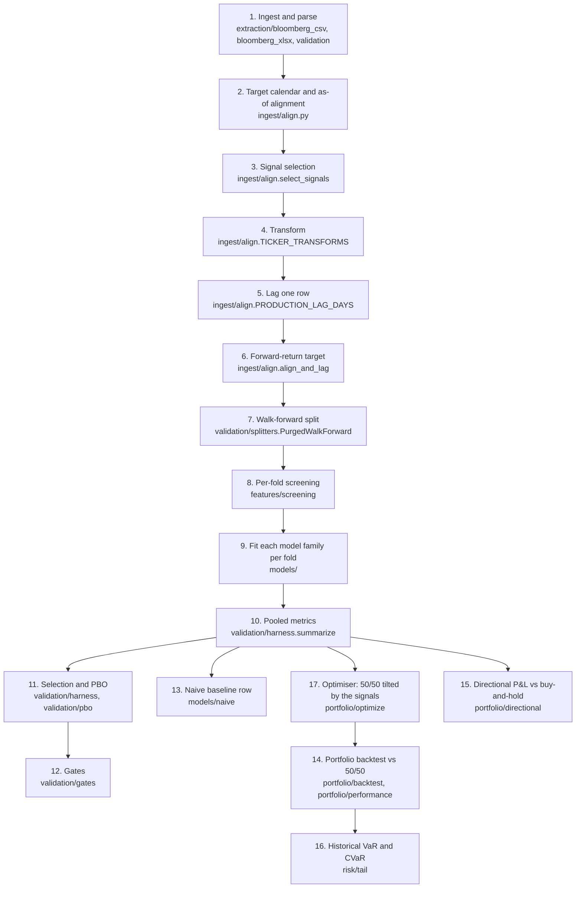

# Methodology

What the engine does to a Bloomberg export before a model is scored, and how
each model is fitted, scored, selected and gated. Every value below is the
code's own constant, named with its module; the [parameters table](#parameters)
lists them all, and `tests/unit/test_methodology_doc.py` fails if any of them
changes without this document being updated.

Module paths are relative to `src/forecasting_engine/` unless they start with
`app/`.

## Pipeline

Step 14 consumes the optimiser's weight schedule (step 17), built from the active
models' signals: it judges an allocation, not a forecast. Step 15 replays one model's out-of-sample
forecasts for one index.

## 1. Ingestion and parsing

Targets and signals are uploaded separately on the Data page, so which series is
a target is decided at ingestion, never inferred later.

- **Reading.** A CSV export is a metadata block then a table headed `Date,...`,
  found by scanning rather than at a fixed row (`extraction/bloomberg_csv.py`).
  An `.xlsx` export is read from its first sheet, laid out like the CSV export:
  its rows become CSV lines and go through the same parser
  (`extraction/bloomberg_xlsx.py`). Only saved values are read; a formula with no
  saved value refuses the file. A workbook with a `Data` sheet is read the older
  way, from `Data` and `Metadata`. Every data column is renamed
  `{security}_{field}`, e.g. `VIX_Index_PX_LAST`. Files over `MAX_UPLOAD_BYTES`
  are refused (`ingest/upload.py`).
- **Per-file schema.** Each file is checked on its own before merging
  (`extraction/validation.schema_errors`). A column whose name contains a
  `POSITIVE_FIELD_MARKERS` entry (a total-return index) must be positive; one
  containing a `NUMERIC_FIELD_MARKERS` entry need only be numeric, since
  `PX_LAST` is any series' last value and a curve can be negative; any other must
  lie within `SANE_RANGE`. A failing file is excluded, and the good files still merge.
- **Merge.** Files are outer-joined on `Date`. Two files sharing a security are
  relabelled by file name. A column with no value on any date is dropped
  (`bloomberg_csv.drop_empty_columns`), and the drop is listed in the data quality
  report.
- **Target roles.** A target file's security pre-fills its role from
  `TARGET_TICKERS`, and its field defaults to `PREFERRED_FIELD` (total return).
  The person uploading confirms or changes both.
- **Report, not correction.** The data quality report counts duplicate and
  weekend dates, missing values per column, and day-over-day changes whose robust
  (median-absolute-deviation) z-score exceeds `MAD_THRESHOLD`. Nothing in it is
  auto-corrected.
- **Commit.** "Use Updated Data" commits the merged frame, the target columns and
  each column's security and field (`bloomberg_csv.column_sources`). Nothing is
  forward-filled.

## 2. Target calendar and as-of alignment

`ingest/align.align_and_lag` builds one panel per target:

1. The calendar is the dates the target has a price. Every other row is dropped.
   The target is never filled.
2. Each signal takes its last observed value on or before each calendar date.
   A value more than `MAX_STALENESS` calendar rows old is treated as missing. The
   Fama-French factors are matched by exact date only, never carried forward.
3. The Models page reports, per signal, how many values were carried forward and
   how many rows have no value once transformed and lagged.

## 3. Signal selection

`ingest/align.select_signals`:

- Every field of a target's security is left out, not only the target column,
  for both targets. The target securities come from the committed target
  assignment, never from a hard-coded list.
- Each security contributes one column: its `TOT_RETURN_INDEX` field if there is
  one, otherwise `PX_LAST` (`_PRICE_FIELD`), otherwise its first other field. Bid
  and ask quotes (`_QUOTE_FIELDS`) are never used.

## 4. Transform map

`ingest/align.TICKER_TRANSFORMS` classifies each ticker by the kind of series it
is:

| Category | Tickers | Transform |
|---|---|---|
| Risk gauges | VIX, JPMVXYGL, LUACOAS, LF98OAS | level (used as is) |
| Rates and curve | USGGBE10, USGG10YR, USYC2Y10 | difference |
| Prices and total-return indices | LF98TRUU, LEGATRUU, LBUSTRUU, SPX, DXY | log return |

Any field starting `TOT_RETURN_INDEX` is a log return whatever its ticker. A
signal with no known ticker is treated as `UNCLASSIFIED_TRANSFORM`, and the Models
page names it in a warning. Transforms are computed on the target calendar, so a
change spans any dropped date. The Fama-French factors are daily returns already
and enter as levels.

## 5. Lag

Every signal is shifted forward `PRODUCTION_LAG_DAYS` row on the target calendar
(`ingest/align.py`), so a value dated today is one that was published before
today's forecast. It is a constant, not a setting.

## 6. Target construction

The target is the simple forward return over `h` rows of the target calendar,
`price[t+h] / price[t] - 1`, for the chosen horizon `h` in `HORIZONS`
(`app/model_settings.py`, default `DEFAULT_HORIZON`). `label_end` records the
date of the price each label reaches, which the splitter uses to purge.

## 7. Walk-forward splitter

`validation/splitters.PurgedWalkForward`:

- **Tuning period.** The first `TUNING_ROWS` rows are reserved. No test window
  starts before `max(train, TUNING_ROWS) + embargo`, for every model family, so
  machine-learning tuning never touches a reported result.
- **Windows.** Test windows of `test` rows roll forward by `test` rows. Each
  training window is the `train` rows ending `embargo` rows before its test
  window (defaults `DEFAULT_TRAIN_WINDOW` and `DEFAULT_TEST_WINDOW`). Training
  windows may reach back into the tuning period. With `train=None` each training
  window is every row before the embargo (an expanding window); the sign-ruled
  polynomial uses one, opening its first test window where the page's splitter
  does, so every model is scored on the same dates.
- **Embargo.** `EMBARGO_DAYS`, the longest horizon (20 days), whichever horizon is
  chosen.
- **Purge.** A training row is dropped if its label's price (`label_end`) is dated
  on or after the test window opens, or if it lies within `h` rows of it.
  `window_before` applies the same purge to tuning windows.

## 8. Per-fold screening

For the derived polynomial and machine learning, each fold screens every
candidate signal on its own training window only (`features/screening.py`). A
signal is kept when the absolute rank IC of the signal against the target is
greater than `INCLUSION_THRESHOLD` (strictly). If a fold keeps no signal, no
model is fitted on it: the fold forecasts its training window's mean target for
every row, with no terms and that mean as its intercept
(`validation/harness.evaluate`). Fitting on the signals that just failed the gate
would let them back in. The Models page shows each signal's transform, its
latest-fold in/out and IC, and how many folds kept it, and says under each
screening model how many folds had no signal pass.

## 9. Model families

Every family on a target tab runs in one Run under the same shared settings —
horizon, lag, walk-forward windows, embargo and so folds — and the results table
states those settings above its rows. Changing any of them clears every tab's
rows together (`app/model_runs.py`); a model's own setting (the derived
polynomial's term cap, the user's formula and the signal each placeholder stands
for) clears only that model's row. Every
family is optional; Run is disabled until one besides the naive baseline is
ticked, and the naive baseline runs with every Run. The polynomial runs one
source at a time, derived or the user's own function, each under its own row
name, and switching source clears nothing. PBO is computed only within a
family's own configurations, so which families run together never changes any
family's result.

Each family is fit per fold on the training window and predicts the test window.
A row missing any signal a model uses is left out of that model's fitting and
scoring (`ModelRunResult.rows_scored` reports how many rows were scored).

- **Fama-French 5** (`models/famafrench.py`, equity target only). OLS with an
  intercept of the target on the five `FACTOR_COLUMNS`, lagged like any signal.
  The regression target is the raw forward return, not the excess return.
  Factors are resolved when the model is run (`ingest/fama_french.resolve`): a
  saved copy younger than `MAX_AGE`, otherwise a fresh download (timeout
  `_TIMEOUT_SECONDS`), falling back to the saved copy with a warning, and an
  error if there is neither. A fold needs at least `_MIN_TRAINING_ROWS` complete
  rows. No configuration search, so no PBO.
- **User polynomial** (`models/polynomial.UserPolynomial`). The user writes the
  shape `f` with placeholders (`x`, `y`, ...) and picks the signal each one
  stands for; a placeholder named after a signal column defaults to it. In each
  fold, `forecast = a + b × f` is fitted by ordinary least squares on the
  training rows where both `f` and the target are present, so the forecast is a
  return rather than a signal's level. If `f` is constant there, `b` = 0 and the
  fold forecasts its training mean. No screening. The page shows the latest
  fold's `a + b × (formula)` and the signal table beside the box (column,
  security, field, transform, 1-day lag, latest value after both). One
  configuration, so no PBO.
- **Derived polynomial, sign-ruled** (`models/sign_ruled.SignRuledPolynomial`;
  the default derivation method wherever its inputs are present, equity only).
  It comes from the October 2026 model research, chosen from about 300 trials
  under a selection rule written before the held-back data was scored. Inputs are `ECONOMIC_INPUTS`: HY OAS, IG OAS, VIX and the
  2s10s slope, each read as a level whatever the transform map says, and each
  with a sign of +1 (a higher value, a higher expected return). Per fold, on an
  expanding window:
  1. each input is turned by its sign, clipped to its training mean ± `CLIP_SD`
     standard deviations and standardised, `z = (x − mean) / sd`;
  2. the forecast's level is the mean of the first `LEVEL_ROWS` training
     labels, not the training mean, which drifts and ranks equity returns the
     wrong way;
  3. the slopes are the posterior mean of a Bayesian regression whose prior pulls
     them toward one common slope `m ≥ 0` (an exchangeable horseshoe; `m` has
     prior scale `COMMON_SLOPE_SCALE`). The likelihood is divided by the labels'
     overlap, `1 / (1 − lag-1 autocorrelation)`, capped at `MAX_OVERLAP`, so
     `h`-day labels count as about `n / h` independent periods;
  4. the posterior is drawn by Gibbs sampling, `CHAINS` chains of `BURN_IN`
     discarded and `KEPT_SWEEPS` kept sweeps from `SEED`, so a fit is
     reproducible.

  The equation is `level + Σ β·z`, one term per input, shown with each input's
  mean, SD and clip range. A fold needs at least `_MIN_TRAINING_ROWS` complete
  rows. One configuration, so no PBO. The app's version reproduces the research
  model's forecasts exactly. Its edge is modest and regime-dependent: in testing
  it was the only derived polynomial to hold up on held-back data (Oct 2024 –
  Sep 2026), but over half of that score came from one quarter (the spring 2025
  spread spike and rebound), and the 1990–2016 history points the other way.
- **Derived polynomial, lasso search** (`models/polynomial.DerivedPolynomial`;
  the method wherever the sign-ruled fit's inputs are missing, and on bond). The grid is
  every degree in `CANDIDATE_DEGREES` with every regularizer in
  `CANDIDATE_REGULARIZERS` (Lasso, and ElasticNet with an L1 share of 0.5, as in
  `_REGULARIZERS`); degree may never exceed `MAX_DEGREE`. Per fold:
  1. each raw signal is clipped to its training mean ± `CLIP_SD` standard
     deviations, and those bounds are shown beside the equation;
  2. each clipped signal is standardised with the same mean and SD,
     `z = (x − mean) / sd`, and the `z` values are expanded with
     `PolynomialFeatures`. A level and its square move almost together (VIX and
     VIX² correlate at about 0.995), so the penalty can't tell them apart; a
     centred signal and its square barely correlate;
  3. the penalty is chosen by time-ordered cross-validation (`TimeSeriesSplit`,
     up to `INNER_CV_SPLITS` folds, gap = `h`, fewer folds when the window is
     short) over `_N_ALPHAS` penalties spanning a factor of `_ALPHA_EPS`, by mean
     squared error. Each split standardises every expanded term using its own
     training rows only, so the rows that judge a penalty never help shape what
     it is judged on. No term is pre-selected: the penalty alone decides which
     survive;
  4. the term cap `max_terms` (default `DEFAULT_MAX_TERMS`) works through the
     penalty. The whole training window's penalty path is walked from the
     largest penalty down, `_PATH_CHUNK` penalties at a time, and stops at the
     first penalty whose fit has more than `max_terms` non-zero coefficients; the
     penalties before it are eligible, and the cross-validated best among them
     is chosen, or the largest penalty if even that exceeds the cap. The small
     penalties a cap rules out are also the slowest to fit, so they are never
     computed. The model is that whole-window fit at the chosen
     penalty; no coefficient is set to zero by hand;
  5. the coefficients are converted back from the scaled terms for display, so
     the equation, written in the standardised signals (e.g.
     `0.0012 + 0.0004·z_VIX − 0.0002·z_VIX²`), reproduces the predictions. Each
     signal's mean and SD (`ModelDescription.standardisation`) are shown under
     it, e.g. `z(VIX) = (VIX − 18.20) / 6.100`.

  A fold needs at least `_MIN_TRAINING_ROWS` complete rows.
- **Machine learning** (`models/boosted.py`). XGBoost and LightGBM, each with
  `_FIXED_PARAMS` and gain feature importance, and minimum leaf size
  (`_LEAF_KEYS`) capped at `LEAF_CAP_SHARE` of a fit's training rows.
  Hyperparameters come from Optuna (TPE, seed 0) over `SEARCH_SPACE`, scored by
  pooled Rank IC over a mini walk-forward inside the tuning window, with the main
  run's train/test/embargo. A trial with undefined Rank IC scores worst.
  - The first tune uses the `TUNING_ROWS` rows before the first test window,
    with `N_TRIALS` trials.
  - A re-tune happens at the first fold whose test window opens `RETUNE_EVERY`
    rows after the previous tune. It uses the `TUNING_ROWS` rows just before that
    test window, purged by `label_end`, and runs `RETUNE_TRIALS` trials,
    starting from the previous best.
  - Each fold uses the most recent tune. A tuning window holding fewer than
    `MIN_TUNING_FOLDS` mini folds is refused before any tuning starts.
  - Tuning searches over every signal; each fold's fit uses its screened
    signals.
  - A fold needs at least `_MIN_TRAINING_ROWS` complete rows.
  - SHAP (mean |SHAP value| per signal) is computed once, for the winning
    library's last fold, refitted with that fold's tune.

## 10. Metrics

`validation/harness.summarize` pools every fold's test predictions and realised
values end to end, then computes once:

- **IC**: the Pearson correlation of prediction and outcome. It mixes the scales
  of different folds' fits, so it is not gated.
- **Signal Rank IC** (`validation/harness.signal_forecasts`), the gated figure:
  the Rank IC of each fold's predictions less that fold's training-window mean
  target, pooled. The training mean is what the naive baseline forecasts, so this
  scores what a model adds to it. A forecast's level moves with its fold's
  training mean whatever the signals say, and on the Sep 2026 Bloomberg data that
  trailing mean ranked future equity returns the wrong way (pooled Rank IC down to
  −0.25 at a 20-day horizon): pooled whole, the level swamped signals that were
  there. `ModelRunResult.baseline` keeps each date's training mean, so the
  portfolio optimiser can read the signal back.
- **OOS Rank IC**: the Spearman correlation of the whole forecast, its level
  included, computed as the Pearson correlation of ranks. Shown, not gated.
- **RMSE.**
- **Two Newey-West standard errors of each of those Rank ICs** (`validation/metrics.rank_ic_se`).
  Each regresses the standardised ranks of the outcome on those of the prediction
  with a HAC covariance: "s.e. (h−1 lags)" allows for overlapping h-day labels,
  and "s.e. (test-window lags)" uses as many lags as a test window has rows,
  allowing for errors shared within a fold's single fit.
- **Rows scored**: test rows with both a prediction and an outcome.
- **Rank IC within folds** (`validation/harness.within_fold_ranks`): the Rank IC
  again, but with each fold's predictions first ranked within that fold, centred
  on zero, then pooled, with its Newey-West standard error over test-window lags.
  Pooling alone ranks predictions across folds, so a forecast whose level merely
  shifts between folds can score there without ranking a single day — on the
  live S&P data a forecast using no signal scored +0.10 that way. Within folds it
  scores nothing. A fold that forecasts one value throughout contributes exactly
  zero.
- **Beyond 2 s.e.**: whether the Signal Rank IC is more than
  `SIGNIFICANCE_SE_MULTIPLE` of the larger of its two standard errors from zero.
- **Constant folds**: how many folds forecast a single value for their whole
  test window.
- **Crash diagnostics** (`validation/crash.py`, a diagnostic, never a gate). A
  day is flagged when its prediction is below the `FLAG_PERCENTILE` quantile of
  that fold's in-sample predictions. It is a true tail day when its return is
  below the training mean minus `TAIL_STD_MULTIPLE` standard deviations. Recall,
  precision and F1 are computed over all folds' labelled days.

## 11. Selection and PBO

Where a family has several setups (the derived polynomial's grid; tuned XGBoost
vs. tuned LightGBM), `validation/harness.select_best_candidate` reports the setup
with the best Signal Rank IC.

PBO is computed by CSCV (`validation/pbo.compute_pbo`):

1. Keep the rows where every setup has a prediction.
2. Split those rows into `N_BLOCKS` contiguous blocks.
3. For every way of calling half the blocks in-sample, rank the setups by Signal
   Rank IC on that half.
4. PBO is the share of splits where the in-sample winner's out-of-sample
   percentile rank (ties averaged) is at or below one half.

A setup whose Rank IC is undefined on a half ranks last. PBO does not count
Optuna's trials, since tuning has its own period.

## 12. Gates

`validation/gates.evaluate_candidate` promotes a model only if both hold:

- the Signal Rank IC is greater than `SIGNAL_RANK_IC_GATE` (strictly);
- PBO is at most `PBO_GATE`.

A model with no configuration search (FF5, a user polynomial, the naive
baseline) has no PBO; it is shown ungated rather than failing. The standard
errors do not enter the gate, and nor do the plain OOS Rank IC, the Rank IC
within folds, Beyond 2 s.e. and Constant folds: those are shown beside it so a reader can see when a
score that meets the gate could be luck or comes from forecast levels alone.

## 13. Naive baseline

"Naive (training mean)" (`models/naive.py`) forecasts each fold's mean target
return over its own training window. It forecasts only on rows where every panel
signal is present, the rows the polynomial and machine learning can score, so the
comparison is like for like. It is scored exactly like the other models, runs on
every Run for both targets, and is not gated. Its signal is zero by definition, so
its Signal Rank IC is undefined ("—"). A constant forecast never flags a
crash day, so its crash recall is 0 and its precision is shown as "—".

## 14. Portfolio backtest

`portfolio/backtest.run_backtest` chains an optimised allocation and the
`BASELINE_WEIGHTS` (50/50) baseline through the same days, gross and net of
costs, and `portfolio/performance` scores both. The optimiser itself is not part
of this step: the allocation arrives as a weight schedule, one row of equity and
bond weights per rebalance date, decided at that day's close.

**Decision, 1 Oct 2026** (ticket: Compare Optimised Portfolio Against
Equal-Weight Baseline). The ticket's acceptance criteria held the optimised
weights fixed for the whole period unless FYP-57 is enabled. They are instead
re-derived at each rebalance, and the baseline is 50/50 rebalanced
`REBALANCE_FREQUENCY`. The backtest supports either: a schedule that repeats the
same weights at every rebalance is the fixed-weight case.

1. **Calendar.** The joint calendar of both indices, from the first rebalance to
   the last day both have a price. On a day one market is shut its last price
   carries forward, so its return is 0 and the move lands the next day it
   trades. A price older than `MAX_STALENESS` rows is refused as a data gap, the
   same limit signals use (§2).
2. **Chaining.** Between rebalances the holdings are left alone, so the weights
   drift with returns; the day's portfolio return uses the drifted weights.
   Holding the target weights every day would be a daily rebalance in disguise.
   The chained returns match a unit-by-unit holdings simulation to rounding
   error on the live data.
3. **The baseline.** `BASELINE_WEIGHTS` at the first rebalance, then reset to
   them on the last trading day of every month strictly inside the period.
   Both portfolios therefore cover exactly the same days.
4. **Turnover and costs.** At each rebalance, turnover is the sum of absolute
   changes from the drifted weights to the targets; the first allocation is
   bought from cash, a turnover of 1, for both portfolios. Each index is charged
   its `DEFAULT_COSTS_BPS` rate on what was traded in it. The cost is compounded
   into that day's net return, `(1 + gross) × (1 − cost) − 1`, and the first
   allocation's into the first day's.
5. **Metrics**, annualised over `TRADING_DAYS_PER_YEAR`, each gross and net, for
   both portfolios:
   - annual return: compounded growth, not the daily mean times a year;
   - Sharpe: mean daily excess return over its sample standard deviation, times
     √`TRADING_DAYS_PER_YEAR`. The excess is over `RISK_FREE_RATE` compounded
     down to a day;
   - Sortino: the same mean over the downside deviation, the root mean squared
     shortfall below the risk-free rate across *every* day (a gain counts as no
     shortfall), not across losing days alone;
   - maximum drawdown: the worst fall from a running peak of the compounded
     path, with the starting value as the first peak;
   - Calmar: annual return over the size of the maximum drawdown;
   - tracking error and information ratio of the optimised portfolio against the
     baseline, from the daily difference in their returns.

   A ratio whose denominator is zero (no variation, no losing day, no drawdown)
   is undefined rather than infinite.

The result is one `BacktestResult`: both daily return paths, gross and net, each
rebalance's weights, turnover and cost, every metric, the historical tail risk
of §16, the period, the rebalance frequency and the active models. It is the
input for display (FYP-19) and for the risk and significance checks (FYP-56,
FYP-52).

## 15. Directional P&L

`portfolio/directional.directional_pnl` asks whether a forecast's direction would
have paid, per index, for one model's run (FYP-162). It uses the run's pooled
out-of-sample forecasts and the realised forward returns they were scored
against (`ModelRunResult.forecast`, `.realised`), so every day replayed is one
the model never trained on.

1. **Period.** Every out-of-sample date the run produced that has a realised
   return; a run's last `h` dates have none yet. A slider narrows this to a
   window of those dates (`start`, `end`), and every figure is recomputed for
   it, as if it were the whole period: steps begin on its first date and both
   cumulative returns start from zero there. The chart zooms and pans in the
   browser alone, so it never reruns the page.
2. **Steps.** At `h` = 1, one call per date. At a longer `h` the dates are
   stepped every `h` dates from the first, so each step's `h`-day return ends
   where the next begins and compounding never counts a day twice. Each horizon is reported
   separately; the page shows the one its results were run under.
3. **Strategy.** Fully invested in the index on a step whose forecast is above
   zero, in cash otherwise, earning that step's realised return or nothing. The
   forecast's size is never used. A step with no forecast (a signal missing) is
   held in cash.
4. **Buy and hold.** The realised return on every step.
5. **Hit rate** is the share of steps with a forecast whose direction matched the
   realised return's (a forecast at or below zero counts as a fall); **share
   invested** is the share of steps in the index.

Everything is gross: no trading cost is charged and cash earns nothing.

## 16. Historical VaR and CVaR

`risk/tail.historical_tail_risk` reads Value at Risk and Conditional VaR straight
off each backtest path's realised daily returns, gross and net, for both
portfolios, at every confidence in `VAR_CONFIDENCES`. There is no volatility model
and no simulation. Each result is tagged "Historical" to tell it apart from Monte
Carlo figures, and carries the path's maximum drawdown (§14) so the two are read
together.

- **Tail.** With `n` returns and confidence `c`, the tail is the `⌈n·(1−c)⌉`
  worst days, so every figure is a day that happened rather than an
  interpolation between two. **VaR** is the loss on the last of those days;
  **CVaR** is the mean loss across them, so it is never below VaR. Both are
  one-day losses, reported as positive numbers; a tail of gains is a negative
  loss rather than zero.
- **Breach rate** (a validation diagnostic). Each day from the
  `VAR_WINDOW`-th on is tested against the VaR of the `VAR_WINDOW` days before it,
  and a loss strictly greater than that VaR is a breach. Testing days against the
  whole period's own VaR would be circular: that VaR is by definition the loss
  exceeded on `1 − c` of those same days, so the rate would come out near `1 − c`
  for any strategy. A rate well above `1 − c` means the historical window
  understated the risk that followed — typically on entering a crisis.

The Portfolio page shows these under the performance table, tagged "Historical",
for both portfolios on the chosen basis (before or after costs), with each
path's maximum drawdown beside them.

## 17. Portfolio optimiser

`portfolio/optimize.weight_schedule` turns the active equity and bond models'
signals into the weight schedule step 14 backtests.

1. **Signals, not forecasts.** Each active model's saved forecast less its
   fold's training-mean target (`store/active_model.get_active_model_signal`),
   as scored by the Signal Rank IC (§10). The training means are left out:
   equity's is far above bond's in most windows and swings with recent
   performance, so in the optimiser it pinned the allocation to a bound on most
   rebalances whatever the signals said.
2. **Rebalance dates.** Every `h`-th date of the out-of-sample period, on the
   calendar both indices share, from the first walk-forward test window's start
   (`common_rebalance_dates`). Each allocation is held for exactly the horizon
   its forecast looks ahead; a 5-day forecast held 20 days says nothing about the
   last 15. With perfect foresight on the Sep 2026 data, rebalancing every 20
   days, a 5-day forecast reached a Sharpe of 1.15 and a 20-day one 1.91, against
   0.83 for 50/50.
3. **Covariance.** Daily equity/bond return covariance over the model's own
   train window, ending `EMBARGO_DAYS` before the rebalance and purged like a
   training window, scaled to `h` days (`covariance_at_rebalance`).
4. **Weights.** The benchmark-relative mean-variance problem: maximise
   `a·s − λ/2 · a'Σa`, where `a` is the tilt from `BASELINE_WEIGHTS`, `s` the
   two signals and `Σ` the covariance. With two assets,
   `w_equity = 0.5 + (s_equity − s_bond) / (λ · D)`, with
   `D = σ_e² − 2σ_eb + σ_b²`, then clipped to the bounds (default
   `DEFAULT_WEIGHT_BOUNDS`, set on the page as a minimum in each index). Risk
   is how far the portfolio strays from 50/50, so with no signal the portfolio is
   the benchmark, and when `D` is zero the benchmark is kept.
5. **Risk aversion.** Chosen on the sponsor's 1-5 scale, 1 most risk-loving and
   5 most risk-averse, and mapped to `λ` by `RISK_AVERSION_SCALE` (default
   `DEFAULT_RISK_LEVEL`). Each step roughly triples `λ`. A working calibration:
   at a 10-day horizon and a 252-day window on the Sep 2026 data, level 1 sits at
   a bound on most rebalances where a signal is present, and level 5 keeps nine
   rebalances in ten within about 12 points of 50/50.

A rebalance whose signal is missing, or whose window can't support a covariance,
is left out. The Portfolio page shows, for the latest rebalance, the benchmark
weight, the signals and the tilt they gave.

## Parameters

Values are Python literals as the code holds them.

| Constant | Module | Value |
|---|---|---|
| `MAX_UPLOAD_BYTES` | `forecasting_engine.ingest.upload` | `25_000_000` |
| `POSITIVE_FIELD_MARKERS` | `forecasting_engine.extraction.validation` | `("TOT_RETURN",)` |
| `NUMERIC_FIELD_MARKERS` | `forecasting_engine.extraction.validation` | `("PX_",)` |
| `SANE_RANGE` | `forecasting_engine.extraction.validation` | `(-300.0, 10_000.0)` |
| `MAD_THRESHOLD` | `forecasting_engine.extraction.validation` | `8.0` |
| `TARGET_TICKERS` | `forecasting_engine.extraction.targets` | `{"SPX Index": "equity", "LBUSTRUU Index": "bond"}` |
| `PREFERRED_FIELD` | `forecasting_engine.extraction.targets` | `"TOT_RETURN_INDEX_GROSS_DVDS"` |
| `MAX_STALENESS` | `forecasting_engine.ingest.align` | `3` |
| `PRODUCTION_LAG_DAYS` | `forecasting_engine.ingest.align` | `1` |
| `TICKER_TRANSFORMS` | `forecasting_engine.ingest.align` | `{"VIX": "level", "JPMVXYGL": "level", "LUACOAS": "level", "LF98OAS": "level", "USGGBE10": "difference", "USGG10YR": "difference", "USYC2Y10": "difference", "LF98TRUU": "log return", "LEGATRUU": "log return", "LBUSTRUU": "log return", "SPX": "log return", "DXY": "log return"}` |
| `UNCLASSIFIED_TRANSFORM` | `forecasting_engine.ingest.align` | `"difference"` |
| `_TOTAL_RETURN_FIELD` | `forecasting_engine.ingest.align` | `"TOT_RETURN_INDEX"` |
| `_PRICE_FIELD` | `forecasting_engine.ingest.align` | `"PX_LAST"` |
| `_QUOTE_FIELDS` | `forecasting_engine.ingest.align` | `frozenset({"PX_BID", "PX_ASK"})` |
| `HORIZONS` | `model_settings` | `(1, 5, 10, 20)` |
| `DEFAULT_HORIZON` | `model_settings` | `20` |
| `EMBARGO_DAYS` | `model_settings` | `20` |
| `DEFAULT_TRAIN_WINDOW` | `model_settings` | `252` |
| `DEFAULT_TEST_WINDOW` | `model_settings` | `20` |
| `DEFAULT_MAX_TERMS` | `model_settings` | `10` |
| `TUNING_ROWS` | `forecasting_engine.validation.splitters` | `504` |
| `INCLUSION_THRESHOLD` | `forecasting_engine.features.screening` | `0.02` |
| `FACTOR_COLUMNS` | `forecasting_engine.models.famafrench` | `("Mkt-RF", "SMB", "HML", "RMW", "CMA")` |
| `_MIN_TRAINING_ROWS` | `forecasting_engine.models.famafrench` | `15` |
| `MAX_AGE` | `forecasting_engine.ingest.fama_french` | `timedelta(days=30)` |
| `_TIMEOUT_SECONDS` | `forecasting_engine.ingest.fama_french` | `30` |
| `MAX_DEGREE` | `forecasting_engine.models.polynomial` | `5` |
| `CANDIDATE_DEGREES` | `forecasting_engine.models.polynomial` | `(1, 2, 3)` |
| `CANDIDATE_REGULARIZERS` | `forecasting_engine.models.polynomial` | `("lasso", "elasticnet")` |
| `CLIP_SD` | `forecasting_engine.models.polynomial` | `4.0` |
| `INNER_CV_SPLITS` | `forecasting_engine.models.polynomial` | `5` |
| `_REGULARIZERS` | `forecasting_engine.models.polynomial` | `{"lasso": 1.0, "elasticnet": 0.5}` |
| `_N_ALPHAS` | `forecasting_engine.models.polynomial` | `100` |
| `_ALPHA_EPS` | `forecasting_engine.models.polynomial` | `1e-3` |
| `_PATH_CHUNK` | `forecasting_engine.models.polynomial` | `10` |
| `_MIN_TRAINING_ROWS` | `forecasting_engine.models.polynomial` | `10` |
| `ECONOMIC_INPUTS` | `forecasting_engine.models.sign_ruled` | `{"equity": {"LF98OAS": 1, "LUACOAS": 1, "VIX": 1, "USYC2Y10": 1}}` |
| `LEVEL_ROWS` | `forecasting_engine.models.sign_ruled` | `252` |
| `COMMON_SLOPE_SCALE` | `forecasting_engine.models.sign_ruled` | `0.2` |
| `MAX_OVERLAP` | `forecasting_engine.models.sign_ruled` | `63.0` |
| `CHAINS` | `forecasting_engine.models.sign_ruled` | `24` |
| `BURN_IN` | `forecasting_engine.models.sign_ruled` | `150` |
| `KEPT_SWEEPS` | `forecasting_engine.models.sign_ruled` | `150` |
| `SEED` | `forecasting_engine.models.sign_ruled` | `20261008` |
| `_MIN_TRAINING_ROWS` | `forecasting_engine.models.sign_ruled` | `30` |
| `_FIXED_PARAMS` | `forecasting_engine.models.boosted` | `{"xgboost": {"verbosity": 0}, "lightgbm": {"verbose": -1, "subsample_freq": 1}}` |
| `_LEAF_KEYS` | `forecasting_engine.models.boosted` | `{"xgboost": "min_child_weight", "lightgbm": "min_child_samples"}` |
| `SEARCH_SPACE` | `forecasting_engine.models.boosted` | `{"n_estimators": (20, 100, False), "max_depth": (2, 4, False), "learning_rate": (0.01, 0.3, True), "subsample": (0.5, 1.0, False), "colsample_bytree": (0.5, 1.0, False), "reg_lambda": (1e-3, 10.0, True), "reg_alpha": (1e-3, 10.0, True), "min_leaf": (5, 100, True)}` |
| `LEAF_CAP_SHARE` | `forecasting_engine.models.boosted` | `0.25` |
| `N_TRIALS` | `forecasting_engine.models.boosted` | `50` |
| `RETUNE_TRIALS` | `forecasting_engine.models.boosted` | `20` |
| `RETUNE_EVERY` | `forecasting_engine.models.boosted` | `252` |
| `MIN_TUNING_FOLDS` | `forecasting_engine.models.boosted` | `3` |
| `_MIN_TRAINING_ROWS` | `forecasting_engine.models.boosted` | `15` |
| `FLAG_PERCENTILE` | `forecasting_engine.validation.crash` | `0.05` |
| `TAIL_STD_MULTIPLE` | `forecasting_engine.validation.crash` | `2.0` |
| `N_BLOCKS` | `forecasting_engine.validation.pbo` | `16` |
| `SIGNAL_RANK_IC_GATE` | `forecasting_engine.validation.gates` | `0.02` |
| `PBO_GATE` | `forecasting_engine.validation.gates` | `0.5` |
| `SIGNIFICANCE_SE_MULTIPLE` | `forecasting_engine.reporting.model_metrics` | `2.0` |
| `TRADING_DAYS_PER_YEAR` | `forecasting_engine.portfolio.performance` | `252` |
| `RISK_FREE_RATE` | `forecasting_engine.portfolio.performance` | `0.0` |
| `BASELINE_WEIGHTS` | `forecasting_engine.portfolio.backtest` | `{"equity": 0.5, "bond": 0.5}` |
| `DEFAULT_COSTS_BPS` | `forecasting_engine.portfolio.backtest` | `{"equity": 3.0, "bond": 5.0}` |
| `REBALANCE_FREQUENCY` | `forecasting_engine.portfolio.backtest` | `"monthly"` |
| `VAR_CONFIDENCES` | `forecasting_engine.risk.tail` | `(0.95, 0.99)` |
| `VAR_WINDOW` | `forecasting_engine.risk.tail` | `252` |
| `RISK_AVERSION_SCALE` | `forecasting_engine.portfolio.optimize` | `{1: 1.0, 2: 3.0, 3: 10.0, 4: 30.0, 5: 100.0}` |
| `DEFAULT_RISK_LEVEL` | `forecasting_engine.portfolio.optimize` | `3` |
| `DEFAULT_WEIGHT_BOUNDS` | `forecasting_engine.portfolio.optimize` | `(0.2, 0.8)` |
